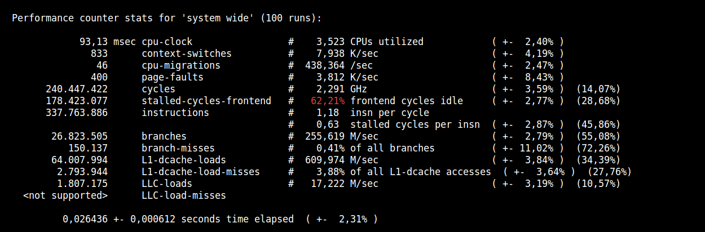

# [in this repo will i follow this article](https://www.justanotherdot.com/posts/profiling-with-perf-and-dhat-on-rust-code-in-linux.html)

## switch to nightly build

```bash
rustup toolchain install  nightly-x86_64-unknown-linux-gnu
```

## set another default

```bash
rustup default nightly
```

## switch from stable to nightly

```bash
# show which  version is default
rustup default

# switch to nightly
rustup default nightly

# switch back to stable
rustup default stable

```

## Show which toolchain will be used in the current directory

[[from here](https://rust-lang.github.io/rustup/examples.html)]

```bash
rustup show
```

## Keeping Rust up to date stable and nightly

[[from here](https://rust-lang.github.io/rustup/basics.html)]

```bash
rustup update
```

## install ubuntu perf (cli)

```bash
sudo apt install linux-intel-iotg-tools-common
```

## if iotg version wrong on ubuntu

> fix it

```bash
sudo apt purge --remove linux-intel-iotg-tools-common linux-tools-common linux-tools-5.15.0-76 linux-tools-5.15.0-76-generic  linux-tools-generic

```

## install standard version perf for ubuntu

```bash
sudo apt install linux-tools-common
```

## install additional package ATTENTION this package must match the installed kernel

check so
>
> echo linux-tools-$(uname -r)
> apt-cache show linux-tools-$(uname -r)
> echo linux-cloud-tools-$(uname -r)
> apt-cache show linux-cloud-tools-$(uname -r)

```bash
sudo apt install linux-tools-5.19.0-46-generic linux-cloud-tools-5.19.0-46-generic
```

## global setting for perf: Allow use of (almost) all events by all users Ignore mlock limit after perf_event_mlock_kb without CAP_IPC_LOCK

```bash
echo -1 | sudo tee /proc/sys/kernel/perf_event_paranoid
```

## test perf stat s. webpage

```bash
perf stat -ad -r 100 target/release/perf-and-dhat-profiling-example test.csv 
<snip, lots of output from the program itself>
```

## output


